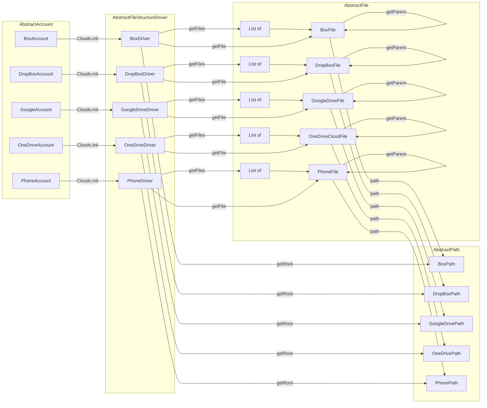
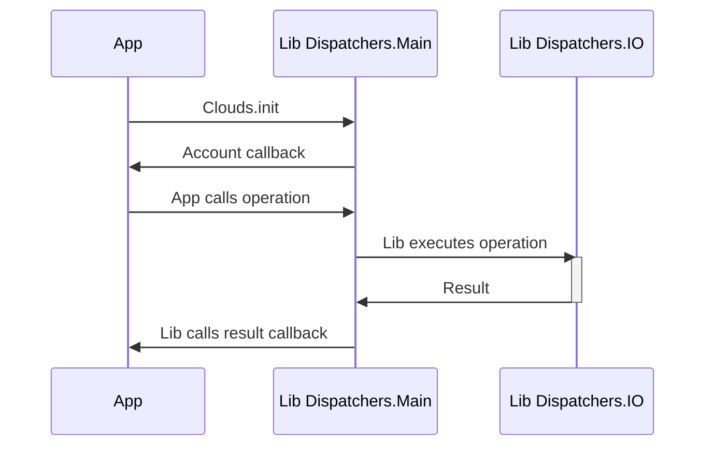

# Laputa Clouds Lib

Manage files in Google Drive, OneDrive, pDrive, Box, DropBox. Spiritual successor to CloudRail.

Allows for foss-only build, that allows skipping non opensource components, without losing features.

## Component graph

## Operation graph

